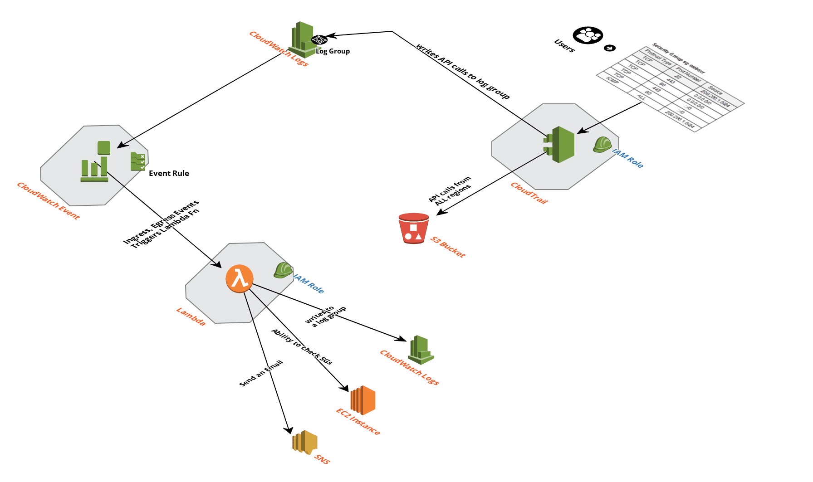

# Defense_In_Depth

This project will help in setting up CloudTrail to write to an S3 bucket along with Cloudwatch log group. Besides,
how cloudwatch events can help us in achieving the better security.

## Prerequisites

    - the AWS CLI is available
    - appropriate AWS credentials are available
    - Terraform is available

Modify terraform.tfvars as per your requirement and run below commands respectively:

``` shell
    terraform init
    terraform plan
    terraform apply
```

``` shell

    .
    ├── README.md
    ├── cloudcraft.png
    ├── cloudtrail.tf
    ├── cloudwatch.tf
    ├── email-sns-stack.json.tpl
    ├── index.py
    ├── lambda.tf
    ├── provider.tf
    ├── sample_cloudwatch_event.json
    ├── sgwatch.zip
    ├── sns.tf
    ├── statefile.tf
    ├── terraform.tfvars
    └── variables.tf
```

## Solution overview

Major intention of this project is to mandate that no default Security Groups (SG) should have any inbound and outbound rules. Along side, if any new rules are being added, wide open rules will be evaluated and reverted if needed to be. The detective control is enforced to keep monitoring using a responsive control, which is implemented using a security group rule. The detective control will identifies any changes made to your security group. Finally, the responsive control reverts changes made to the security group and then sends a notification of this security mitigation.

The detective control, in this case, is an Amazon CloudWatch event that detects changes to your security group and triggers the responsive control, which in this case is an AWS Lambda function. I am using Terraform for this project.

The following diagram shows the architecture of this solution.



Here is how the process works:

    1. Someone on your staff adds a new ingress rule to your security group.
    1. A CloudWatch event that continually monitors changes to your security groups detects the new ingress rule and invokes a designated Lambda function (with Lambda, you can run code without provisioning or managing servers).
    1. The Lambda function then examines the configuration event that was passed to it as a result of the configuration change. The configuration event contains a list variable named ip_permissions that comes from the IpPermissions field of the Config event payload.
    1. The Lambda function will delete all the rules if the change is on default SG, else reverts the new security group ingress rule if its deviating from the desired rules.
    1. Finally, the Lambda function sends you an email to let you know what the change was, and that the change was reverted.

- __Note__

    Terraform is not supporting email as the topic resource, since given mail address  needs to be confirmed out of bounds. I had to use a wrapper  CloudFormation stack that creates an SNS email topic and exposes the topics ARN back to, and through, Terraform.